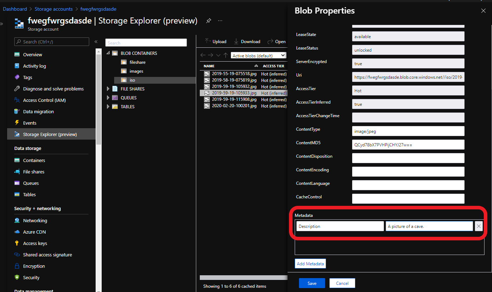

# Azure Web App Storage Download Front-End

## Contents
- [Intro](#intro)
- [Configure](#Configure)
- [Usage](#Usage)
- [Variables](#variables)

---

### Intro

--- 

This is a simple Azure Web App built on .NET Core that will front-end Azure Storage to allow files to be downloaded. AAD authentication is enabled after the deployment requiring users to authenticate before gaining access. Once authenticated users are presented a list of files with auto-generated and expiring URL links allowing "read" access. Most settings are configurable via "Configuration" settings in the Web App.

Special thanks to [Matt Ruma](https://github.com/mattruma) who built the initial [application](https://github.com/mattruma/MJR133).
   

### Configure
---

Using the "Deploy to Azure" button below will deploy the following resources into your environment:
 
Resource | Description | SKU | Estimated Price (USD)
-------- |------------ | --- | --------------- 
[App Service](https://azure.microsoft.com/en-us/services/app-service/) | .NET Core Web Site | B1 | $55/mo
[Storage Account](https://azure.microsoft.com/en-us/services/storage/blobs/) | Blob Storage | Standard (GPv2) LRS HOT | $0.02 per GB/mo

After the deployment we need to configure AAD integrated authentication and update a variable with the newly created app ID.
  

 1. Configure AAD authentication on the Web App 
  

 >  
  

 2. Configure the Microsoft authentication provider 
  

> 
  

 3. Configure authentication options 
  
  
>  
  

 4. Copy the application ID 
  

> 
  

 5. Configure the AzureAd:ClientId variable with the copied ID from step 4 
  

> 
  

### Usage
---

Files uploaded into the specified storage account container will be visible in the web UI. The file description can also be displayed by adding metadata to the files. The value for a metadata key named: "Description" or "description" will be displayed in the web application. The easiest way to control this is using Storage Explorer (thick client or Azure Portal), right clicking on the blob(file), choosing "Properties", and then adding "Description" and a value in the metadata section.

> 

If a file has the metadata listed above it will be displayed on the page.

> 

### Variables
---

The following variables can be configured from the Azure Portal.

Variable | Description | Default Value 
-------- |------------ | ------------- 
SITE_TITLE | Title of site displayed on webpage | Corporate File Download 
WEBSITE_RUN_FROM_PACKAGE | URL of zip file for App Service to run | https://github.com/edm-ms/poc/raw/main/file-download-webapp/site.zip
AZURE_STORAGE_CONNECTION_STRING | Connection string for Azure Storage account |  generated at deployment
AZURE_STORAGE_SAS_TOKEN_DURATION | Duration download link is valid in minutes | 15
AZURE_STORAGE_CONTAINER | Storage container where files are located | iso
SAS_GENERATION_METHOD | URL generation method (webapp or logicapp) | webapp
AzureAd:ClientId | Application ID of webapp | 
AzureAd:Domain | Azure AD domain name | passed as parameter in deployment
AzureAd:TenantId | Azure AD tenant ID | default tenant ID of subscription